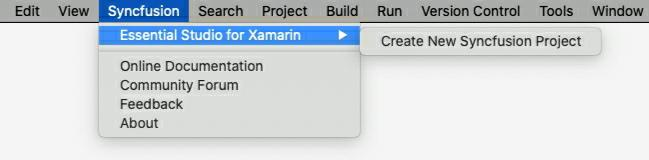
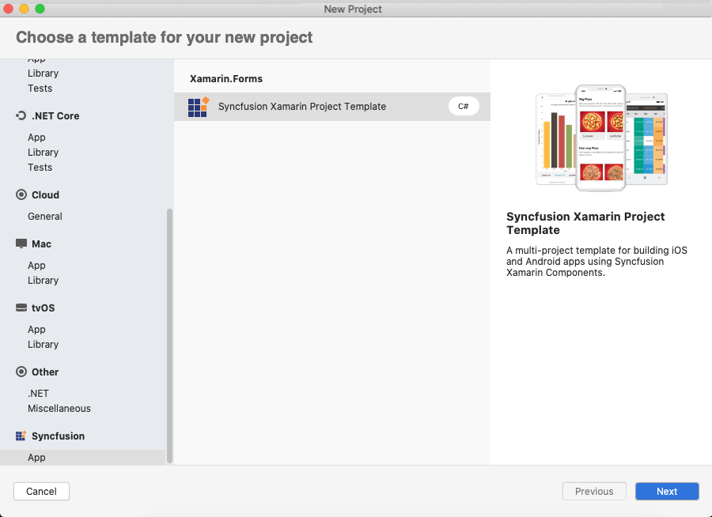
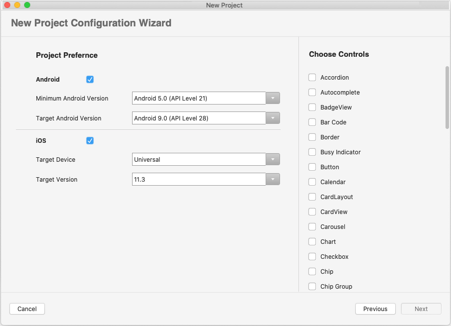

## The Syncfusion Xamarin Extension for Visual Studio Mac

The Syncfusion Essential Studio for Xamarin's Visual Studio for Mac extension allows you to create Xamarin applications in Visual Studio for Mac with Syncfusion components.

Download the latest Syncfusion Xamarin project template extension file (.mpack) from the following location.

[v19.2.0.55](https://files2.syncfusion.com/Installs/v19.2.0.55/Mac/Syncfusion%20Xamarin%20VSMacExtensions.mpack)

[v19.2.0.44](https://files2.syncfusion.com/Installs/v19.2.0.44/Mac/Syncfusion%20Xamarin%20VSMacExtensions.mpack)

[v19.1.0.63](https://files2.syncfusion.com/Installs/v19.1.0.63/Mac/Syncfusion%20Xamarin%20VSMacExtensions.mpack)

[v19.1.0.54](https://files2.syncfusion.com/Installs/v19.1.0.54/Mac/Syncfusion%20Xamarin%20VSMacExtensions.mpack)

[v18.4.0.39](https://files2.syncfusion.com/Installs/v18.4.0.39/Mac/Syncfusion%20Xamarin%20VSMacExtensions.mpack)

[v18.4.0.30](https://files2.syncfusion.com/Installs/v18.4.0.30/Mac/Syncfusion%20Xamarin%20VSMacExtensions.mpack)

[v18.3.0.47](https://files2.syncfusion.com/Installs/v18.3.0.47/Mac/Syncfusion%20Xamarin%20VSMacExtensions.mpack)

[v18.3.0.35](https://files2.syncfusion.com/Installs/v18.3.0.35/Mac/Syncfusion%20Xamarin%20VSMacExtensions.mpack)

[v18.2.0.44](https://files2.syncfusion.com/Installs/v18.2.0.44/Mac/Syncfusion%20Xamarin%20VSMacExtensions.mpack)

Then follow the steps from the next link to install the Syncfusion Xamarin project template extension in Visual Studio for Mac.

https://help.syncfusion.com/xamarin/visual-studio-integration/visual-studio-mac-extensions/installation

**Highlights:**

* Over 150 essential Xamarin controls like DataGrid, Chart, and ListView, and unique file-format libraries.
* User-friendly controls that are easy to configure in Xamarin projects with Syncfusion control references (NuGet packages are automatically downloaded from NuGet.org, no installer required).
* Most-downloaded Xamarin third-party controls in [NuGet.org](https://www.nuget.org/profiles/SyncfusionInc).

The Syncfusion Xamarin extension installs prebuilt templates with Visual Studio for Mac. This project template allows you to create a new project with Syncfusion references, and then use configurators to customize the projects by selecting the required versions for Xamarin.Andriod and Xamarin.iOS. It also allows you to select the controls to be included in the project. These templates provide a starting point for users to begin creating projects.

To learn more about the Syncfusion Xamarin project template for Visual Studio Mac, refer to [this documentation](https://help.syncfusion.com/xamarin/visual-studio-integration/visual-studio-mac-extensions/create-project).

## Additional resources

[Learn More about Xamarin UI Controls](https://www.syncfusion.com/xamarin-ui-controls?utm_medium=listing&utm_source=github&utm_campaign=xamarin-trial-github)

[Download Free Trial](https://www.syncfusion.com/downloads?utm_medium=listing&utm_source=github&utm_campaign=xamarin-trial-github)

[Release History](https://help.syncfusion.com/xamarin/release-notes?utm_medium=listing&utm_source=github&utm_campaign=xamarin-trial-github)

[Pricing](https://www.syncfusion.com/sales/products/xamarin?utm_medium=listing&utm_source=github&utm_campaign=xamarin-trial-github)

[Online Demos](https://www.syncfusion.com/demos/xamarin?utm_medium=listing&utm_source=github&utm_campaign=xamarin-trial-github)

[Community Forums](https://www.syncfusion.com/forums/xamarin.forms?utm_medium=listing&utm_source=github&utm_campaign=xamarin-trial-github)

[Suggest a Feature](https://www.syncfusion.com/feedback/xamarin-forms?utm_medium=listing&utm_source=github&utm_campaign=xamarin-trial-github)
